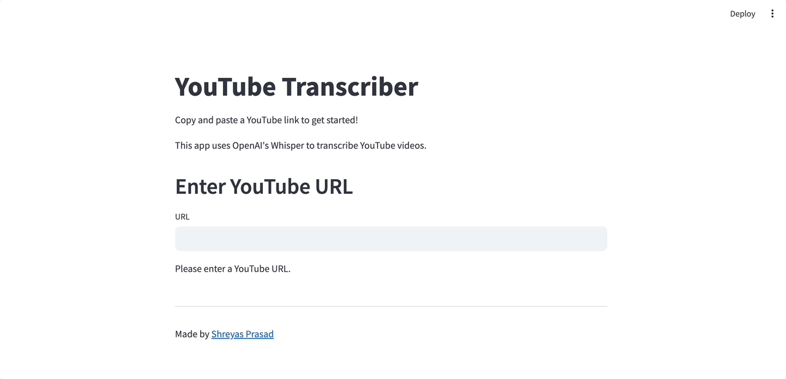

# YouTube Transcriber Project

## Overview
YouTube Transcriber is an application that allows users to transcribe YouTube videos using OpenAI's Whisper model. This application is built using Streamlit for the frontend and FastAPI for the backend.




## Features
- **YouTube URL validation**: Ensures the provided URL is a valid YouTube link.
- **Transcription**: Uses Whisper to transcribe the audio of YouTube videos.
- **Streamlit Interface**: A user-friendly web interface for submitting URLs and viewing transcriptions.
- **FastAPI Backend**: Handles audio downloading, conversion, and transcription processing.

## Installation

### Prerequisites
- Python 3.6+
- FastAPI
- Streamlit
- Whisper
- PyTube

### Setup
1. Clone the repository:
   ```
   git clone [repository URL]
   ```
2. Install the required dependencies:
   ```
   pip install -r requirements.txt
   ```

## Running the Application
1. Start the FastAPI server:
   ```
   uvicorn app.endpoint:app --reload
   ```
2. Open a new terminal and run the Streamlit app:
   ```
   python -m streamlit run frontend/server.py
   ```

## Usage
- Enter a valid YouTube URL in the Streamlit interface.
- The application will validate the URL, download the audio, convert it to an appropriate format, and then transcribe it.
- The transcription will be displayed on the Streamlit interface.

## Backend API Endpoints
- `GET /`: Root endpoint for basic API health check.
- `POST /filename/`: Endpoint to download YouTube audio from a given URL.
- `POST /transcribe/`: Endpoint to transcribe the audio from a given URL.

## Frontend (Streamlit)
- Streamlit interface for easy interaction with the application.
- Input field for YouTube URL.
- Display area for transcription results or error messages.

## Command-Line Interface
- For direct command-line usage, use the following command with the YouTube URL:
  ```
  python [script_name].py [YouTube URL]
  ```
- Optional argument `-o` to specify the output file for transcription.

## Error Handling
- The application handles various errors such as invalid URLs, download failures, and transcription errors.

## Contributing
Contributions to the project are welcome. Raise an issue or submit a pull request to contribute.

## Author
- Made by Shreyas Prasad ([Website](https://shreyasprasad.com))

## License
This project is licensed under the [MIT License](LICENSE).

---
**Note**: Replace `[repository URL]`, `[streamlit_app_file].py`, and `[script_name].py` with the actual file names in your project repository.
